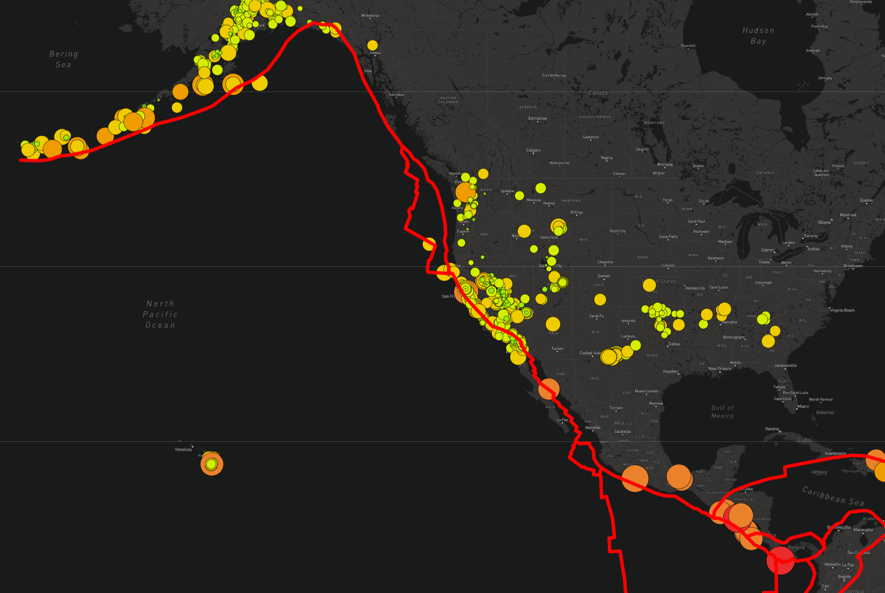

# Mapping Earthquakes
Leaflet, Mapbox, GeoJSON, JavaScript, CSS, HTML

[Click here to view the map](https://macdkw89.github.io/Mapping_Earthquakes/Earthquake_Challenge/index.html)

The purpose of this project is to use the JS Leaflet library and the Mapbox API to map earthquake data from the US Geological Survey

